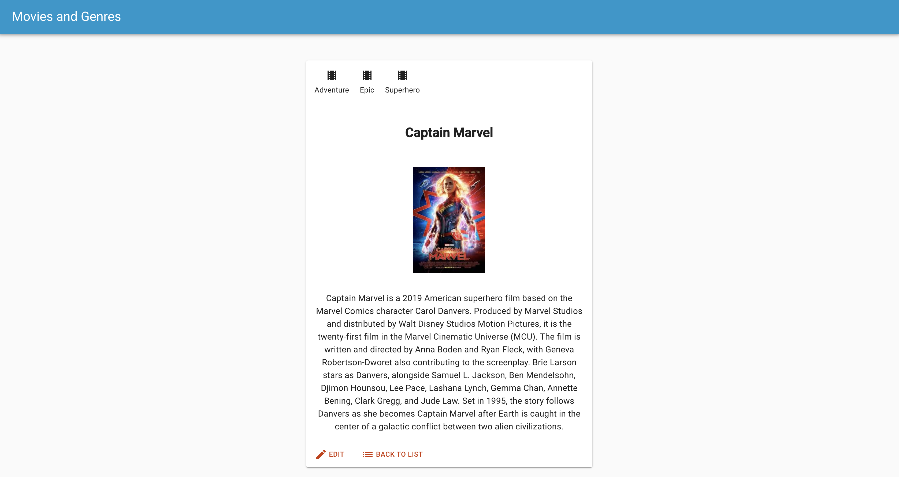

# Movies and Genres Application

In this project, I utilized React, Redux, and Redux-Sagas to display information about movies that were listed in a database.  A junction table was created to establish a Many-to-Many relationship between movies and genres.  Users have the ability to view details about a movie, and edit the movie's title and description.

[Link to Application](https://cryptic-journey-95926.herokuapp.com/)

## Technologies Used

Material-UI, Node.js, PostgresSQL, React.js, Redux, and Redux-Sagas

## Getting Started

These instructions will get you a copy of the project up and running on your local machine for development and testing purposes.

### Prerequisites

This software is required prior to starting the application.

- [Node.js](https://nodejs.org/en/)
- [PostgreSQL](https://www.postgresql.org/)
- [Nodemon](https://nodemon.io/)

### Installing

Steps to get the development environment running.

1. Download this project.
2. Create a SQL database and tables by referencing the provided database.sql file.
3. `npm install`
4. `npm run server`
5. `npm run client`

## Live Demo

Click the image below to watch a YouTube demo of this application.

## Screenshots

## License
[MIT](https://choosealicense.com/licenses/mit/)

## Author

- Max Maher
